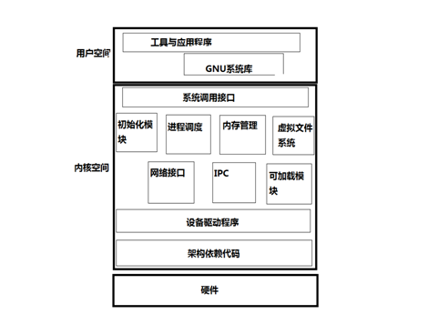
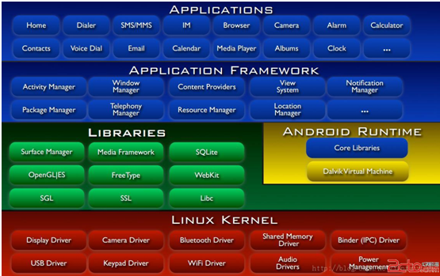
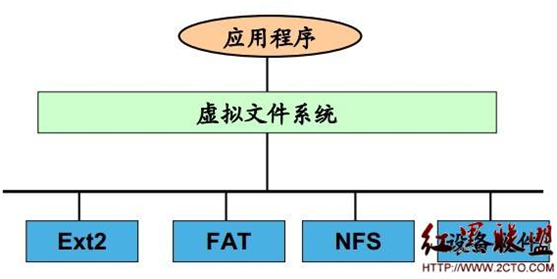
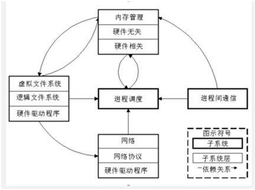

#linux内核简介

从上图开始介绍linux内核

最内层是硬件，最外层是我们常用的各种应用，比如firefox浏览器。硬件是我们的物质基础，任何计算机相关的东西都是，而应用时我们为之奋斗的目标，但是怎么将硬件和应用结合起来，还得需要周折一番。

- (1)硬件

linux安装时候所有可能的物理设备，例如：CPU、内存、硬盘、网络、硬件等等

- (2)内核

是操作系统的灵魂，它负责管理磁盘上的文件、内存，负责启动并运行程序，负责从网络上接收和发送数据包等等，内核实际上是抽象的资源操作到具体的硬件操作细节之间的接口，是外界与硬件交互的桥梁。

- (3)系统调用

为了方便调用内核，将内核封装成系统调用。系统调用像c语言函数，你可以在程序中直接调用（可以理解为汉字中的笔画），系统调用对外展现的是一堆清晰的接口。一个个操作系统的功能可以看做是系统调用函数的组合（类似一个汉字是由很多笔画组成的）。

$man 2 syscalls 查看所有系统调用

- (4)库函数

由于系统调用函数用起来比较繁琐，一个分配内存空间操作，需要多个系统调用。所有linux定义了一些库函数，比如内存分配函数malloc()。使用库函数对机器来说没有效率上的优势，但是封装性更好了，便于程序员使用。库函数类似于汉字中的偏旁部首，它由笔画组成（系统函数）

- (5)shell

shell是一个命令解释器，当输入ls –l时，会在默认路径下找到/bin/ls，执行该文件并附带参数-l。shell有很多种，最常用的是bash和csh

- (6)应用

从上图可以发现，应用时一个程序，可以直接调用系统函数，也可以调用库函数，运行shell script。这些应用可以由多种语言开发，满足计算机的各种需求。用户应用程序是运行在linux操作系统最高层的庞大软件集合，当一个用户程序在操作系统上运行时，它在操作系统中是一个进程。

Linux分为：用户空间和内核空间。内核空间和用户空间是程序执行的两种不同的状态，通过系统调用和硬件中断能够完成从用户空间到内核空间的转移。Linux利用内核实现了软硬件的对话。

###linux内核架构图

从程序员的角度来讲，操作系统的内核提供了一个与计算机硬件等价的扩展或虚拟的计算平台。抽象了许多硬件的细节，程序可以以某种统一的方式进行数据处理，程序员可以避开许多硬件细节。普通用户则把操作系统看成是一个资源管理者。

Linux以统一的方式支持多任务，而这种方式对用户进程是透明的，每一个进程运行起来就好像只有他一个进程在计算机上运行一样，独占内存和其他硬件的资源，而实际上，内核在冰法的运行多个进程，并且能够让几个进程公平合理的使用硬件资源，也能使各进程之间互不干扰安全的运行。

		GNU/Linux操作系统简单架构

备注：IPC进程间通。IPC(Inter-Process Communication)是共享"命名管道"的资源，它是为了让进程间通信而开放的命名管道，
        
通过提供可信任的用户名和口令，连接双方可以建立安全的通道并以此通道进行加密数据的交换，从而实现对远程计算机的访问

GUN C和ANSI C函数库区别：libc是linux下的ANSIC的函数库，而glibc是linux下的GUN C的函数库，基本上两者没什么差别

		Linux操作系统详细架构
		

###linux内核的抽象结构

Linux内核主要由五个子系统组成：进程调度，内存管理，虚拟文件系统，网络接口，进程间通信。

这里先简单介绍下各个的功能，后边会详细介绍

- (1)进程调度

控制进程对cpu的访问。当需要选择下一个进程运行时，由调度程序选择最值得运行的程序。可运行进程实际上是仅等待CPU资源的进程，如果某个进程在等待其它资源，则该进程是不可运行进程。Linux使用了比较简单的基于优先级的进程调度算法选择新的进程。

- (2)内存管理

允许多个进程安全的共享主内存区域。Linux 的内存管理支持虚拟内存，即在计算机中运行的程序，其代码，数据，堆栈的总量可以超过实际内存的大小，操作系统只是把当前使用的程序块保留在内存中，其余的程序块则保留在磁盘中。必要时，操作系统负责在磁盘和内存间交换程序块。内存管理从逻辑上分为硬件无关部分和硬件有关部分。硬件无关部分提供了进程的映射和逻辑内存的对换；硬件相关的部分为内存管理硬件提供了虚拟接口。

- (3)虚拟文件系统

隐藏了各种硬件的具体细节，为所有的设备提供了统一的接口，VFS提供了多达数十种不同的文件系统。虚拟文件系统可以分为逻辑文件系统和设备驱动程序。逻辑文件系统指Linux所支持的文件系统，如ext2,fat等，设备驱动程序指为每一种硬件控制器所编写的设备驱动程序模块。

- (4)网络接口

提供了对各种网络标准的存取和各种网络硬件的支持。网络接口可分为网络协议和网络驱动程序。网络协议部分负责实现每一种可能的网络传输协议。网络设备驱动程序负责与硬件设备通讯，每一种可能的硬件设备都有相应的设备驱动程序。

- (5)进程间通信

支持进程间各种通信机制。

		Linux内核子系统及其之间的关系

各个系统之间的关系

进程调度与内存管理的关系：这两个子系统相互依赖。程序要运行必须为之创建进程，而创建进程的第一件事情就是要将程序和数据装入内存。

进程间通信与内存管理的关系：进程间通信子系统要依赖内存管理支持共享内存通信机制，这种机制允许两个进程除了拥有自己的私有内存，还可存取共同的内存区域。

虚拟文件系统与网络接口的关系：虚拟文件系统利用网络接口支持网络文件系统（NFS），也利用内存管理支持RAMDISK设备

内存管理与虚拟文件系统的关系：内存管理利用虚拟文件系统支持交换，交换进程（swapd）定期的由调度程序调度，这也是内存管理依赖于进程调度的唯一原因。当一个进程存取的内存映射被换出时，内存管理向文件系统发出请求，同时，挂起当前正在运行的进程。

注意：除了上图之外，内核的所有子系统还要依赖一些共同的资源，譬如：分配和释放内存空间的过程，打印警告或错误信息的过程，系统的调试例程等。

###linux内核启动

在理解linux的内核启动过程时，先了解下windows的启动过程

- 1.Windows启动过程：

- 2.Linux启动过程：

（1）操作系统的启动过程：

（2）确定是linux系统后，加载内核操作系统接管硬件以后，首先读入/boot目录下的内核文件

我虚拟的系统是opensuse，boot下目录结构如下

（3）内核加载以后，就开始运行第一个程序/sbin/init，它的作用是初始化系统环境

第一个进程的pid=1，其他进程都是他的子进程。

（4）确定运行级别

许多程序需要开机启动。他们在windows叫做服务，在linux就叫做守护进程（daemon）
Init进程的任务是去运行这些开机启动的程序。但是，不同的场合需要启动不同的程序，比如用作服务器时，需要启动apache，用作桌面时就不需要。Linux运行为不同的场合分配不同的开机程序，叫做运行级别（runlevel）.启动时根据运行级别确定运行哪些程序

Linux预置七种运行级别（0-6）。一般来说，0是关机，1是单用户模式（也就是维护模式），6是重启。运行级别2-5，各个发行版不太一样，对于Debian来说，都是同样的多用户模式（也就是正常模式）。

init进程首先读取文件 /etc/inittab，它是运行级别的设置文件。文件内容如下：

initdefault的值是2，表明系统启动时的运行级别为2。如果需要指定其他级别，可以手动修改这个值。上图运行级别是5

/etc/rc0.d等，rc表示run command（运行程序），最后的d表示directory（目录）。在/etc/rc2.d目录下是启动的程序

文件名都是"字母S+两位数字+程序名"的形式。字母S表示Start，也就是启动的意思（启动脚本的运行参数为start），如果这个位置是字母K，就代表Kill（关闭），即如果从其他运行级别切换过来，需要关闭的程序（启动脚本的运行参数为stop）。后面的两位数字表示处理顺序，数字越小越早处理

（5）加载开机启动程序

前面提到，七种预设的"运行级别"各自有一个目录，存放需要开机启动的程序。不难想到，如果多个"运行级别"需要启动同一个程序，那么这个程序的启动脚本，就会在每一个目录里都有一个拷贝。这样会造成管理上的困扰：如果要修改启动脚本，岂不是每个目录都要改一遍？

Linux的解决办法，就是七个 /etc/rcN.d 目录里列出的程序，都设为链接文件，指向另外一个目录 /etc/init.d ，真正的启动脚本都统一放在这个目录中。init进程逐一加载开机启动程序，其实就是运行这个目录里的启动脚本。（上图中的软连接）/etc/init.d 这个目录名最后一个字母d，是directory的意思，表示这是一个目录，用来与程序 /etc/init 区分。

（6）用户登录

一般用户登录方式有三种：

命令行登录：init进程调用getty程序（意为get teletype），让用户输入用户名和密码。输入完成后，再调用login程序，核对密码（Debian还会再多运行一个身份核对程序/etc/pam.d/login）。如果密码正确，就从文件 /etc/passwd 读取该用户指定的shell，然后启动这个shell。

Ssh登录：这时系统调用sshd程序（Debian还会再运行/etc/pam.d/ssh ），取代getty和login，然后启动shell。

图形界面登录：init进程调用显示管理器，Gnome图形界面对应的显示管理器为gdm（GNOME Display Manager），然后用户输入用户名和密码。如果密码正确，就读取/etc/gdm3/Xsession，启动用户的会话。

（7）进入login shell

所谓shell，简单说就是命令行界面，让用户可以直接与操作系统对话。用户登录时打开的shell，就叫做login shell。

命令行登录首先会读入/etc/profile，这是对所有用户都有效的配置；然后依次寻找下边三个文件，是针对当前用户的配置。.bash_profile/.bash_login/.profile.这三个文件只要一个存在，后边的就不读入。

Ssh登录与第一种情况完全相同，图形界面登录只加载/etc/profile和profile

（8）打开non-login shell

老实说，上一步完成以后，Linux的启动过程就算结束了，用户已经可以看到命令行提示符或者图形界面了。但是，为了内容的完整，必须再介绍一下这一步。
用户进入操作系统以后，常常会再手动开启一个shell。这个shell就叫做 non-login shell，意思是它不同于登录时出现的那个shell，不读取/etc/profile和.profile等配置文件。
non-login shell的重要性，不仅在于它是用户最常接触的那个shell，还在于它会读入用户自己的bash配置文件 ~/.bashrc。大多数时候，我们对于bash的定制，都是写在这个文件里面的。

要是不进入 non-login shell，岂不是.bashrc就不会运行了，因此bash 也就不能完成定制了？事实上，Debian已经考虑到这个问题了，请打开文件 ~/.profile，可以看到下面的代码：

###linux内核代码架构图

