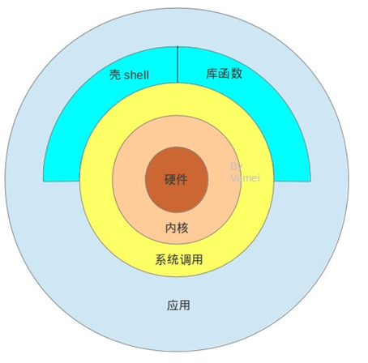
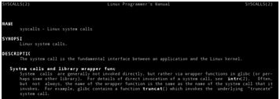

#linux内核简介

从上图开始介绍linux内核

最内层是硬件，最外层是我们常用的各种应用，比如firefox浏览器。硬件是我们的物质基础，任何计算机相关的东西都是，而应用时我们为之奋斗的目标，但是怎么将硬件和应用结合起来，还得需要周折一番。

- (1)硬件

linux安装时候所有可能的物理设备，例如：CPU、内存、硬盘、网络、硬件等等

- (2)内核

是操作系统的灵魂，它负责管理磁盘上的文件、内存，负责启动并运行程序，负责从网络上接收和发送数据包等等，内核实际上是抽象的资源操作到具体的硬件操作细节之间的接口，是外界与硬件交互的桥梁。

- (3)系统调用

为了方便调用内核，将内核封装成系统调用。系统调用像c语言函数，你可以在程序中直接调用（可以理解为汉字中的笔画），系统调用对外展现的是一堆清晰的接口。一个个操作系统的功能可以看做是系统调用函数的组合（类似一个汉字是由很多笔画组成的）。

$man 2 syscalls 查看所有系统调用

- (4)库函数

由于系统调用函数用起来比较繁琐，一个分配内存空间操作，需要多个系统调用。所有linux定义了一些库函数，比如内存分配函数malloc()。使用库函数对机器来说没有效率上的优势，但是封装性更好了，便于程序员使用。库函数类似于汉字中的偏旁部首，它由笔画组成（系统函数）

- (5)shell

shell是一个命令解释器，当输入ls –l时，会在默认路径下找到/bin/ls，执行该文件并附带参数-l。shell有很多种，最常用的是bash和csh

- (6)应用

从上图可以发现，应用时一个程序，可以直接调用系统函数，也可以调用库函数，运行shell script。这些应用可以由多种语言开发，满足计算机的各种需求。用户应用程序是运行在linux操作系统最高层的庞大软件集合，当一个用户程序在操作系统上运行时，它在操作系统中是一个进程。

Linux分为：用户空间和内核空间。内核空间和用户空间是程序执行的两种不同的状态，通过系统调用和硬件中断能够完成从用户空间到内核空间的转移。Linux利用内核实现了软硬件的对话。

###linux内核架构图

###linux内核的抽象结构

###linux内核启动

###linux内核代码架构图

